# 🚗 CDAC Vehicle Configuration System

A full-stack vehicle configuration and invoice generation system built using:

- ⚙️ Spring Boot (Backend)
- 🗄️ MySQL Database
- 💻 React.js (Frontend)
- 📄 iText PDF (Invoice Generation)
- 🌐 Multi-language Support (English, Hindi, French, Marathi, Sanskrit)
=======
# 🚗 CDAC Vehicle Configurator Project

A full-stack **Vehicle Configuration System** developed as part of the **CDAC final project**, enabling users to configure vehicles, manage components, authenticate using OAuth, and generate invoices.

This repository follows a **monorepo structure** and contains **backend (Java + .NET)** and **frontend (React)** applications in a single GitHub repository.


---

## 📌 Project Overview


The Vehicle Configuration System allows users to:

- Register company details
- Login securely
- Configure vehicles (segment, manufacturer, model)
- Customize features (Interior, Exterior, Accessories)
- Generate invoices
- Download / Email PDF invoice
- View dashboard analytics

---

# 🧭 Application Flow (Step-by-Step Guide)

---

## 1️⃣ Registration (4 Steps)

### Step 1 – Company Details
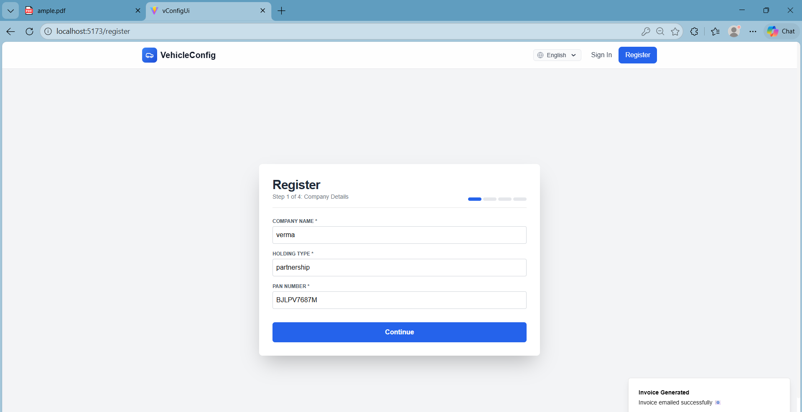

- Company Name  
- Holding Type  
- PAN Number  

---

### Step 2 – Personal Details
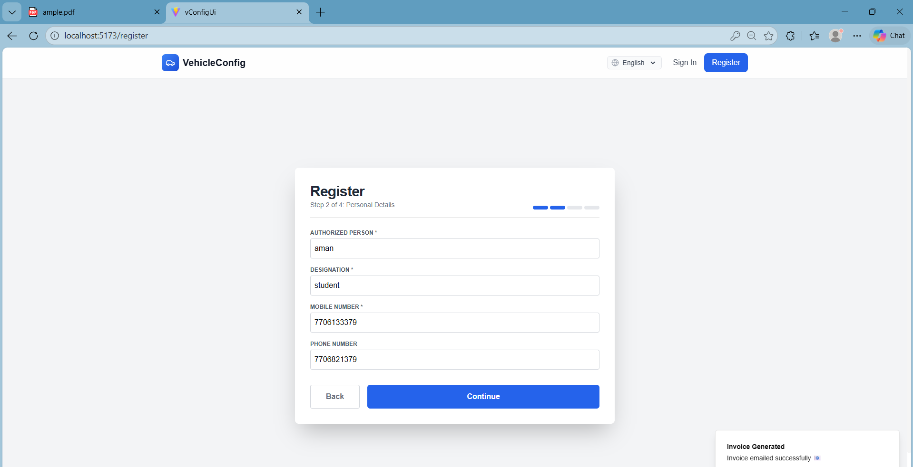

- Authorized Person  
- Designation  
- Mobile Number  

---

### Step 3 – Address Details
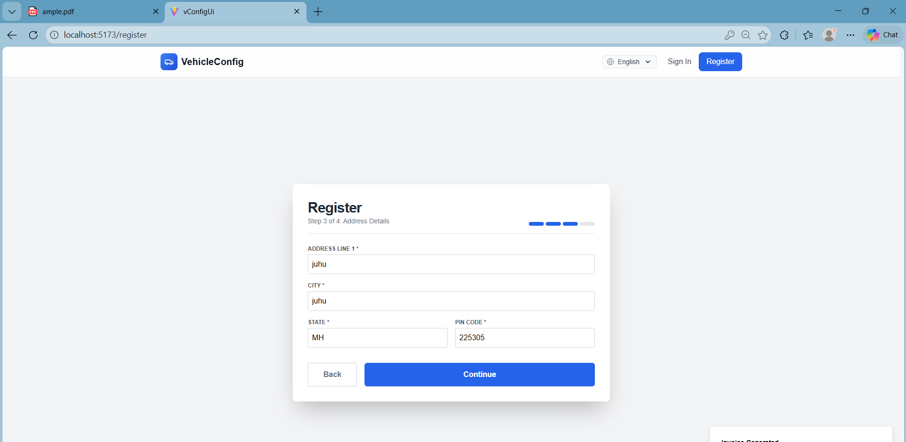

- Address Line  
- City  
- State  
- Pin Code  

---

### Step 4 – Account Details
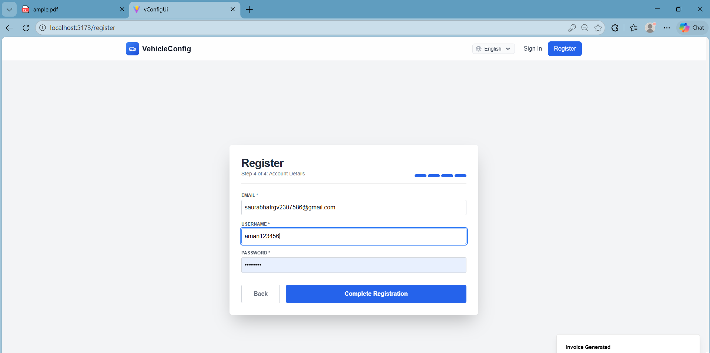

- Email  
- Username  
- Password  

After successful registration → User can Login.

---

## 2️⃣ Login

### English Login
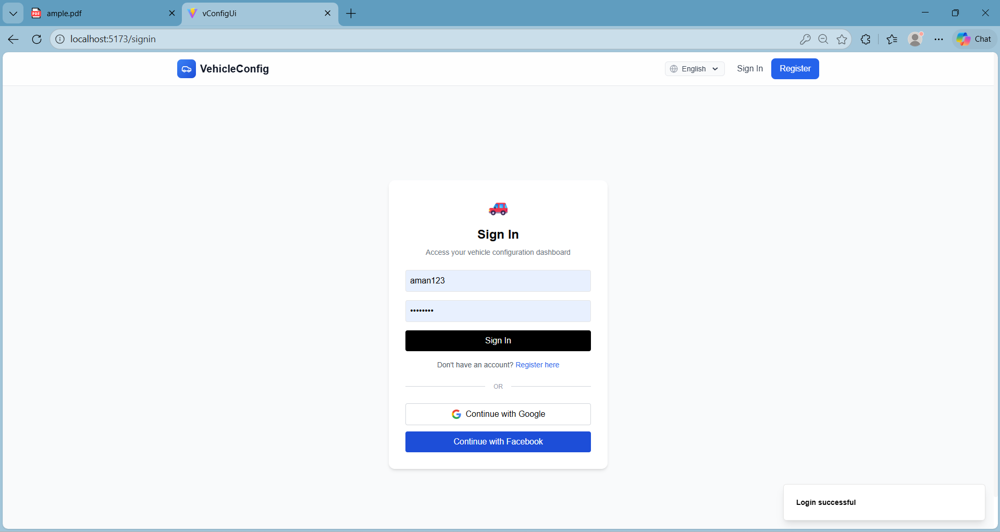


User logs in using:

- Username  
- Password  

Supports:
- Multi-language toggle  
### Hindi Login
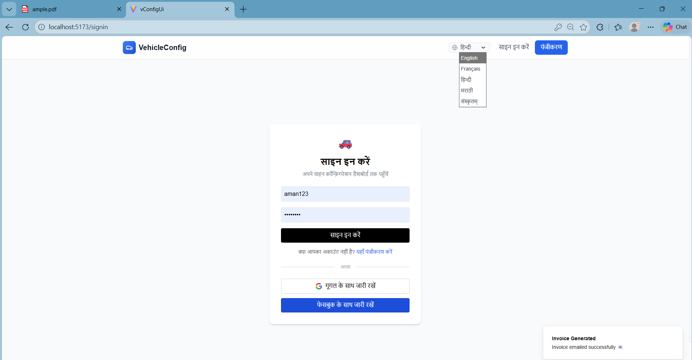

- Google login (optional)  
- Facebook login (optional)  

---

## 3️⃣ Dashboard


After login, dashboard shows:

- Total Configurations  
- Pending Invoices  
- Recent Activity  
- Revenue Overview  

Quick Actions:
- New Configuration  
- Browse Templates  
- Upload Excel  

---

## 4️⃣ Configure Vehicle

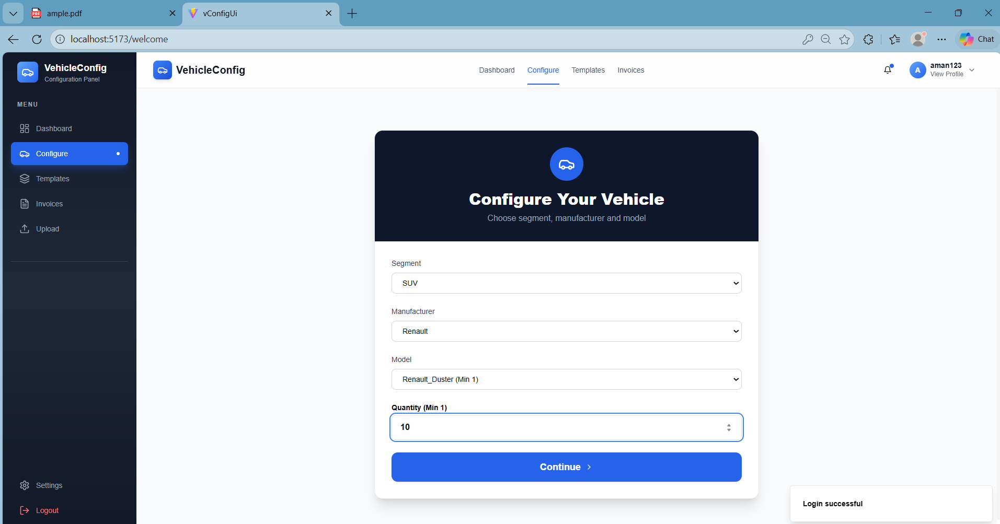

Steps:

1. Select Segment (SUV, Sedan etc.)
2. Select Manufacturer
3. Select Model
4. Enter Quantity
5. Click Continue

---

## 5️⃣ Default Configuration Page

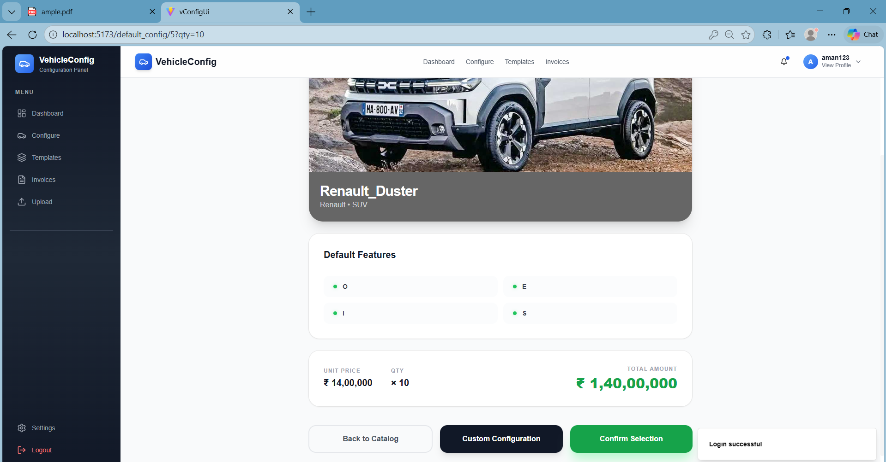

Shows:

- Default Features  
- Unit Price  
- Quantity  
- Total Amount  

Options:
- Custom Configuration  
- Confirm Selection  

---

## 6️⃣ Custom Configuration

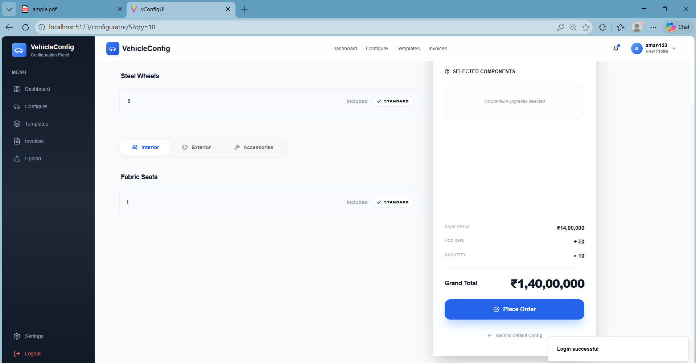

User can customize:

- Interior  
- Exterior  
- Accessories  

Selected components are shown on right side with price adjustment.

---

## 7️⃣ Invoice Generation

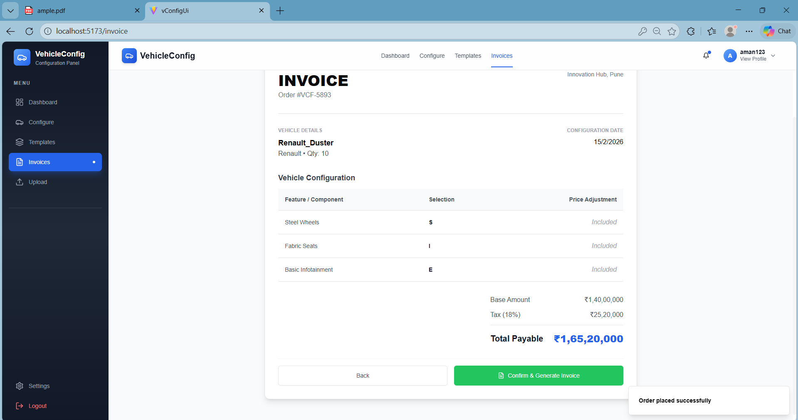

Invoice page shows:

- Order ID  
- Vehicle Details  
- Configuration Summary  
- Base Amount  
- Tax (18%)  
- Total Payable  

Click:
👉 **Confirm & Generate Invoice**

PDF invoice is generated using iText library.

---

## 8️⃣ Order Confirmation Page

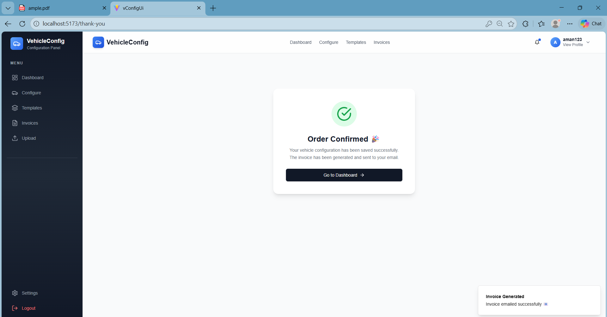

Shows:

✔ Order Confirmed  
✔ Invoice Generated  
✔ Invoice sent to email  

---

# 🛠️ Technologies Used

## 🔹 Backend
- Java 17
- Spring Boot 3
- Spring Security
- Spring Data JPA
- Hibernate
- MySQL
- iText PDF

## 🔹 Frontend
- React.js
- Tailwind CSS
- Axios

---

# 🗄️ Database Configuration

Update `application-dev.properties`:

```properties
spring.datasource.url=jdbc:mysql://localhost:3306/v_vconf_micro
spring.datasource.username=root
spring.datasource.password=your_password
spring.jpa.hibernate.ddl-auto=update


# ▶️ How to Run the Project
## 🔹 Run Backend
cd v-conf
mvn spring-boot:run


Backend runs on:

http://localhost:8080

 ##🔹 Run Frontend
cd vConfigUi
=======
The Vehicle Configurator allows users to:
- Register and authenticate (JWT + OAuth)
- Select vehicle segments, models, and components
- Configure vehicles dynamically
- Generate invoices and PDFs
- Manage users and configurations securely

---

## 🧱 Tech Stack

### 🔙 Backend
- **Java (Spring Boot)**
  - Spring Security (JWT + OAuth2)
  - REST APIs
  - Maven
- **.NET (ASP.NET Core Web API)**
  - Entity Framework
  - RESTful services

### 🎨 Frontend
- **React.js**
  - Vite
  - Tailwind CSS
  - Axios
  - React Router

### 🛢️ Database
- MySQL / PostgreSQL (configurable)

---

## 📂 Repository Structure

```text
cdac-VehicleConfigurator/
│
├── v-conf-java/          # Spring Boot backend
│   └── v-conf/
│
├── v-conf-c#/            # ASP.NET Core backend
│   └── vehicle_config_c#/
│
├── v-conf-frontend/      # React frontend
│   └── finalui/
│
├── .gitignore
├── README.md
└── .env.example

------------------------------------------------------------------------
------------------------------------------------------------------------

🔐 Security & Configuration

⚠️ Secrets are NOT committed to this repository

OAuth credentials and sensitive values are managed using environment variables.

Required Environment Variables
GOOGLE_CLIENT_ID=your_google_client_id
GOOGLE_CLIENT_SECRET=your_google_client_secret
FACEBOOK_CLIENT_ID=your_facebook_client_id
FACEBOOK_CLIENT_SECRET=your_facebook_client_secret
JWT_SECRET=your_jwt_secret
DB_USERNAME=your_db_user
DB_PASSWORD=your_db_password


---------------------------------------------------------

▶️ How to Run the Project
1️⃣ Backend – Spring Boot
cd v-conf-java/v-conf/v-conf
mvn spring-boot:run


Runs on:

http://localhost:8080

2️⃣ Backend – .NET API
cd v-conf-c#/vehicle_config_c#/project_vc#
dotnet run


Runs on:

https://localhost:5001

3️⃣ Frontend – React
cd v-conf-frontend/finalui/FinalVconfigUi

npm install
npm run dev


<<<<<<< HEAD
Frontend runs on:

http://localhost:5173

📄 Key Features

✔ Multi-step Registration
✔ Multi-language Support
✔ Role-based Authentication
✔ Vehicle Customization
✔ Dynamic Pricing Calculation
✔ Invoice PDF Generation
✔ Email Integration
✔ Dashboard Analytics
✔ Secure Login using Spring Security

# 📊 Project Architecture

Frontend (Vue.js)
⬇
REST API (Spring Boot)
⬇
Service Layer
⬇
JPA / Hibernate
⬇
MySQL Database

## PDF generation handled via iText library.

# 👨‍💻 Author

## Aman Verma
### CDAC Final Project

# 📜 License

This project is developed for educational purposes under CDAC curriculum.


=======
Runs on:

http://localhost:5173

---------------------------------------------

🧪 Features

🔐 Secure Authentication (JWT + OAuth2)

🚘 Vehicle Configuration Engine

🧩 Dynamic Component Selection

🧾 Invoice Generation (PDF)

🌐 Multi-language Support

📊 Admin & User Dashboards

📁 Clean Monorepo Structure

📸 Screenshots

(Add screenshots here if needed)

👨‍💻 Contributors

Aman Verma – Full Stack Developer (CDAC)

📜 License

This project is developed for academic purposes (CDAC).
Feel free to explore and learn from the code.

⭐ Acknowledgements

CDAC Faculty & Mentors

Spring Boot & React Open Source Community


